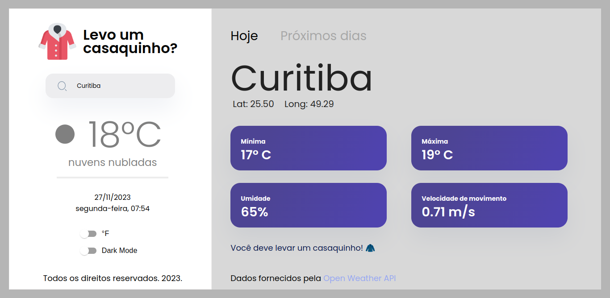
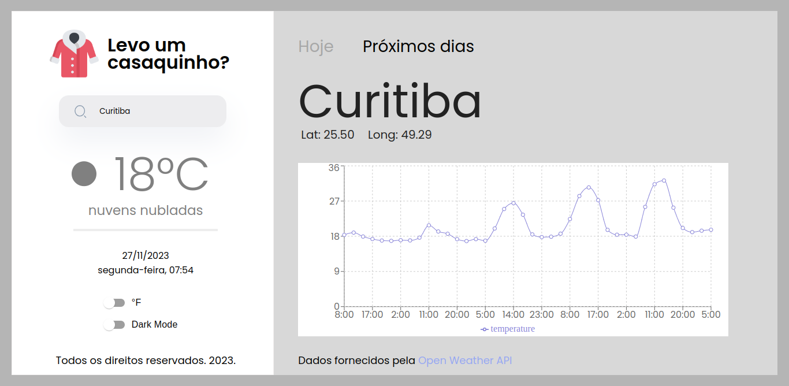

### Link do deploy: 
- [https://projeto25-levo-um-casaquinho-nu.vercel.app/](https://projeto25-levo-um-casaquinho-delta.vercel.app/)


#
# Projeto #25: Desafio Técnico - Levo um casaquinho? 

## Weather App 🧥 

####Seção Inicial:

Bem-vindo ao projeto de Previsão do Tempo! Este aplicativo foi desenvolvido para fornecer informações precisas e intuitivas sobre o clima em qualquer lugar do mundo. Através de uma interface amigável, você pode visualizar dados climáticos atuais, previsões futuras e gráficos históricos para tomar decisões informadas sobre seu guarda-roupa e atividades diárias. Descubra se é necessário levar um guarda-chuva ou se é o momento ideal para um passeio ao ar livre. Esteja preparado para qualquer condição meteorológica com o nosso aplicativo de previsão do tempo fácil de usar.

####Tecnologias Utilizadas:

Este projeto faz uso de tecnologias modernas para proporcionar uma experiência de usuário eficiente e envolvente. O frontend é desenvolvido em React.js, utilizando Styled Components para a estilização, proporcionando uma aparência limpa e responsiva. A integração com a API de previsão do tempo é realizada através do Axios, permitindo uma comunicação eficiente com o backend. O estado global da aplicação é gerenciado pelo Context API do React, proporcionando uma gestão eficaz dos dados em toda a aplicação. Além disso, a biblioteca Day.js é utilizada para manipulação e formatação de datas, enquanto o pacote SweetAlert2 adiciona notificações visuais e interativas em casos de erros ou confirmações.

#### SOBRE

Este é um aplicativo simples para verificar as condições climáticas de uma cidade específica.

## Como rodar: 


1. Clone esse repositório

```bash
git clone (link SSH do repositorio )
```

2. Instale todas as dependências

```bash
npm i
```

3. Crie um arquivo chamado `.env` e configure-o com base no exemplo `.env.example`. `VITE_API_URL` deverá conter o link da API (OpenWeatherMap)

4. Rode o projeto com o seguinte comando no seu terminal e abrir a aplicação pelo link gerado:

```bash
npm run dev
```


## Como Usar:

1 - Abra o navegador e acesse [https://projeto25-levo-um-casaquinho-nu.vercel.app/](https://projeto25-levo-um-casaquinho-delta.vercel.app/) para ver o aplicativo.

2 - Na interface, insira o nome de uma cidade na caixa de pesquisa e pressione Enter ou clique no ícone de pesquisa.



3 - Os dados climáticos para a cidade inserida serão exibidos, incluindo a temperatura, descrição do clima e um gráfico de previsão de temperatura.




## Funcionalidades

#### Pesquisa de Cidade : 
Insira o nome de uma cidade para obter informações climáticas.

#### Gráfico de Previsão: 
Visualize uma previsão de temperatura para os próximos dias.

#### Recomendação de Roupas: 
Com base na temperatura média, o aplicativo recomenda se você deve levar um casaquinho.


#
#

Aproveite o App e curta a experiência!!  😊
